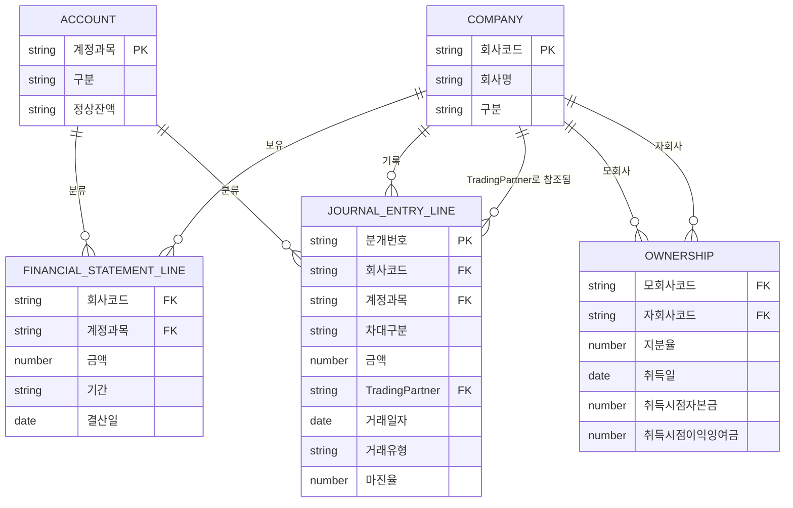

# 4주차 — ERD (엔터티-관계 모델)

Company 마스터를 추가해 5개 엔터티로 정리한 ER 다이어그램. `data/company_master.csv`가
새로 추가된 파일이며, `generate_data.py`도 이를 반영해 재생성했다 (참조 무결성 검증 포함).

## 엔터티별 요약

| 엔터티 | 파일 | PK | 설명 |
| --- | --- | --- | --- |
| COMPANY | `company_master.csv` | 회사코드 | 그룹 내 회사 마스터 (신규 추가) |
| ACCOUNT | `account_master.csv` | 계정과목 | 계정과목 마스터 |
| FINANCIAL_STATEMENT_LINE | `financial_statements.csv` | (회사코드, 계정과목, 기간) | 회사별 재무제표 라인 |
| JOURNAL_ENTRY_LINE | `journal_entries.csv` | (분개번호, 계정과목, 차대구분) | 내부거래 분개 라인 |
| OWNERSHIP | `ownership.csv` | (모회사코드, 자회사코드) | 지분율 및 취득시점 자본 |

## FK 관계

| FK 위치 | 참조 대상 | 용도 |
| --- | --- | --- |
| FINANCIAL_STATEMENT_LINE.회사코드 | COMPANY.회사코드 | 어느 회사의 재무제표인지 |
| FINANCIAL_STATEMENT_LINE.계정과목 | ACCOUNT.계정과목 | 계정 분류 |
| JOURNAL_ENTRY_LINE.회사코드 | COMPANY.회사코드 | 분개를 기록한 회사 |
| JOURNAL_ENTRY_LINE.TradingPartner | COMPANY.회사코드 | 내부거래 상대회사 (FR-3, FR-9 판정 기준) |
| JOURNAL_ENTRY_LINE.계정과목 | ACCOUNT.계정과목 | 계정 분류 |
| OWNERSHIP.모회사코드 / 자회사코드 | COMPANY.회사코드 | 지분관계의 양 당사자 |

## 이번 변경이 FR-9에 미치는 영향

FR-9 체크 조건 중 "Trading Partner가 지분율 테이블에 없는 회사코드인 경우"를
COMPANY 마스터 기준으로 더 엄격하게 정의할 수 있게 됨:

- **TP가 COMPANY 마스터에 없는 코드** → 오타/존재하지 않는 회사 (완전한 결함)
- **TP가 COMPANY 마스터엔 있지만 OWNERSHIP 관계가 없는 회사** → 그룹 내 회사이지만
  지분관계가 정의 안 된 경우 (별도 판단 필요 — 형제회사 간 직접거래 등)

이 구분은 5주차 아키텍처 설계에서 검증 로직 모듈 설계 시 반영할 것.
